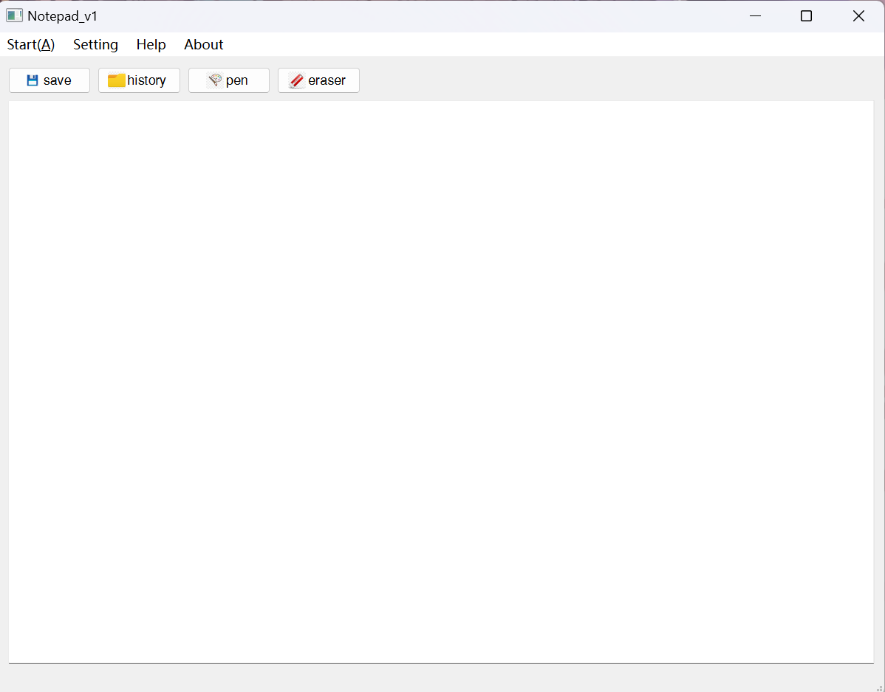

# personal-notepad
> 本项目是个人的qt6入门作品

### 项目结构📗

- main.cpp    项目主体结构
- mainwindow.cpp   包含Mainwindow上各种控件的slot函数实现
- mainwindow.ui    项目的ui设计
- mainwindow.h      项目定义的各种头文件，类实现
- image.qrc    包含项目中使用到的图片

### 功能介绍🎗️

- **push buttons**
  - save     保存文本，并将文本框修改成只读模式
  - history    在读写模式下可将上一次保存记录恢复
  - pen    将文本框修改成读写模式
  - eraser    在读写模式下清除文本框中的所有内容
- **menubar**
  - Start      调出与4个push button相同功能的action
  - Setting    弹出一个messagebox
  - Help    未添加功能
  - About    其中的action可访问仓库地址

